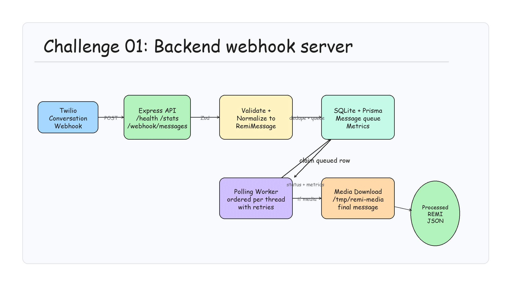

# REMI SMS / Group Message Ingestor

Standalone Node.js + TypeScript service for Assignment 1 of the REMI engineering challenge.

The service accepts mock Twilio Conversations `onMessageAdded` webhook payloads, normalizes them into `RemiMessage`, stores raw and normalized payloads in SQLite through Prisma, prevents duplicate processing, preserves ordering per Conversation using Twilio message `Index`, handles media asynchronously, and exposes health/stats endpoints.

## Architecture Diagram



Editable Excalidraw diagram: [`architecture.excalidraw`](architecture.excalidraw)

## Tech Stack

- Node.js
- TypeScript
- Express
- Prisma + SQLite
- Zod
- TSX

## Local Setup

```bash
npm install
npm run db:push
npm run dev
```

The server runs on:

```txt
http://localhost:3000
```

## Run the Simulation

```bash
npm run simulate
```

The simulation starts the Express app on a random local port, resets SQLite data, starts the same-process worker, sends practical Twilio Conversations-shaped webhook payloads, and asserts that all required behavior works.

It covers:

- Ordered messages in one property operations Conversation.
- A deliberate out-of-order delivery where Twilio index `2` arrives before index `1`.
- Duplicate webhook delivery.
- Multiple Conversations sent concurrently.
- MMS media download into `/tmp/remi-media`.
- Worker failure once, then retry and recovery.
- `/stats` validation.

## Endpoints

### `POST /webhook/messages`

Accepts a Twilio Conversations-style `onMessageAdded` webhook.

Response for new messages:

```json
{
  "status": "queued",
  "id": "cm...",
  "threadId": "CH11111111111111111111111111111111",
  "messageIndex": 1
}
```

Response for duplicates:

```json
{
  "status": "duplicate_ignored",
  "id": "cm...",
  "threadId": "CH11111111111111111111111111111111",
  "messageIndex": 1
}
```

### `GET /health`

Returns basic service health.

### `GET /stats`

Returns:

```json
{
  "messagesReceived": 9,
  "messagesProcessed": 8,
  "duplicatesIgnored": 1,
  "failedMessages": 0,
  "pendingQueueDepth": 0,
  "queuedMessages": 0,
  "processingMessages": 0
}
```

## `RemiMessage` Interface

Defined in [`src/lib/domain/remiMessage.ts`](src/lib/domain/remiMessage.ts).

Minimum required fields are present:

- `provider`
- `providerMessageId`
- `groupId`
- `threadId`
- `senderPhoneNumber`
- `participantPhoneNumbers`
- `timestamp`
- `textBody`
- `mediaAttachments`
- `rawPayloadReference`
- `receivedAt`

The interface also includes:

- `metadata.twilio.conversationSid`
- `metadata.twilio.messageSid`
- `metadata.twilio.messageIndex`
- `metadata.twilio.participantSid`
- `metadata.media`

## Queue and Worker Model

This project uses SQLite as the durable queue. There is no Redis or BullMQ.

Webhook flow:

1. Validate the mock Twilio Conversations payload with Zod.
2. Normalize to `RemiMessage`.
3. Insert raw and normalized JSON into SQLite with `status = QUEUED`.
4. Return `202` quickly.

Worker flow:

1. Poll SQLite for `QUEUED` rows.
2. Wait a short stabilization window so closely arriving out-of-order webhooks can land first.
3. Claim a row by setting `status = PROCESSING`.
4. Process different Conversations concurrently.
5. For the same Conversation, do not process a later known Twilio `Index` while an earlier known index is queued or processing.
6. Download media to `/tmp/remi-media`.
7. Log the final `RemiMessage` JSON.
8. Mark the row `PROCESSED`, or retry until `maxAttempts` is reached.

This is intentionally simple but production-shaped. In a larger deployment, the same boundaries could move to a separate worker process with SQS, Temporal, or Redis/BullMQ.

## Mock Data

Mock data lives in:

```txt
scripts/simulate.ts
```

There is no permanent seed data.

The simulation includes:

- Mountain Muse plumbing thread.
- Lake Escape guest AC issue.
- Cine Lodge electrical/vendor thread.
- Host, cleaner, co-host, guest, plumber, electrician, contractor, and REMI participants.
- A media attachment with a local temporary URL.
- A simulated worker failure using message attributes.

The mock payload includes a `ParticipantSnapshot` field. Real Twilio `onMessageAdded` webhooks do not include every participant phone number directly. In production, REMI would fetch or cache participants from Twilio's Conversation Participant API. The mock snapshot represents that production lookup without needing real Twilio credentials.

## Provider Decision

See [`ARCHITECTURE.md`](ARCHITECTURE.md).

Short version: Twilio Conversations was chosen because it provides native Group MMS, managed participants, media support, and a message `Index` that gives a stronger per-group ordering model than raw SMS/MMS webhooks.

## Useful Scripts

```bash
npm run dev              # run local server with worker
npm run simulate         # run complete mock simulation
npm run typecheck        # TypeScript typecheck
npm run build            # compile TypeScript
npm run db:push          # apply Prisma schema to local SQLite
```
