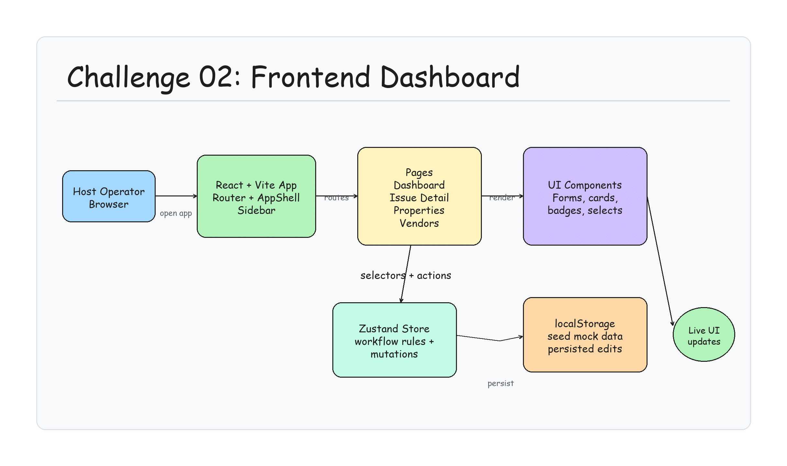

# 🛠️ REMI — Maintenance Operator Portal

A lightweight operator portal for property hosts to triage and manage maintenance
issues end-to-end — set up properties and vendors, track tickets through their
lifecycle, assign vendors, comment, and watch an auto-generated activity timeline.

Built for **Aye Aye Vacations — Engineering Challenge #2**.

> **Stack:** React 19 · TypeScript · Vite · Tailwind CSS v4 · shadcn/ui · Zustand
> **Theme:** Indigo, light mode only · Fully client-side (no backend, no auth)

---

## Architecture Diagram



Editable Excalidraw diagram: [`architecture.excalidraw`](architecture.excalidraw)

---

## ✨ What it does

| Area | Highlights |
| --- | --- |
| **Dashboard** | At-a-glance stats (open / urgent / awaiting-vendor / in-progress), full-text search, filter by status · priority · property, and sort. Every issue card surfaces title, property, status, priority, assigned vendor, and last-updated. |
| **Issue Detail** | Description, full metadata (reported-by, reported-via, created, last-updated), inline status & priority controls, vendor assignment with a contact card, internal comments, and a live activity timeline. |
| **Comments** | Chronological internal notes, persisted to local state, rendered instantly on submit (⌘/Ctrl + Enter to post). |
| **Status lifecycle** | All 8 states — Reported → Diagnosing → Vendor Needed → Vendor Assigned → In Progress → Resolved → Verified → Closed — changed via dropdown. |
| **Vendor assignment** | Sourced from your configured vendor directory, with **category-aware suggestions** (e.g. a Plumbing issue surfaces plumbers first). |
| **Activity timeline** | Status changes, priority changes, vendor assignment/removal, and comments are **appended automatically** as timeline events. |
| **Property setup** | Create & edit properties (name, address, type, beds, baths, optional cover image) as a visual portfolio. |
| **Vendor setup** | Create & edit operational contacts across all 6 categories (Cleaner, Plumber, Electrician, Handyman, General Contractor, Co-Host). |
| **Persistence** | Everything is saved to `localStorage`, so your edits survive a refresh. A **Reset demo data** action restores the seed. |

---

## 🚀 Getting started

**Prerequisites:** Node.js ≥ 18 and npm.

```bash
# from this directory (challenge02/)
npm install
npm run dev       # start the dev server → http://localhost:5173
```

Other scripts:

```bash
npm run build     # type-check (tsc -b) + production build to dist/
npm run preview   # preview the production build locally
npm run lint      # run ESLint
```

---

## 🗂️ Project structure

```
src/
├─ data/
│  └─ mock-data.ts        # Seed: 5 properties, 10 vendors, 9 issues (all 8 statuses)
├─ lib/
│  ├─ types.ts            # Domain model (Property, Vendor, Issue, Comment, TimelineEvent)
│  ├─ constants.ts        # Status / priority / vendor / category metadata (colors, icons, order)
│  └─ format.ts           # Date, id, and label helpers (date-fns)
├─ store/
│  └─ useStore.ts         # Zustand store (+ persist) — single source of truth & all mutations
├─ components/
│  ├─ ui/                 # shadcn/ui primitives
│  ├─ shared/             # Reusable building blocks (badges, selects, PageHeader, EmptyState…)
│  ├─ layout/             # AppShell + AppSidebar
│  ├─ dashboard/          # StatsRow, IssueCard, IssueFilters
│  ├─ issues/             # IssueFormDialog, CommentsSection, TimelineSection
│  ├─ properties/         # PropertyCard, PropertyFormDialog
│  └─ vendors/            # VendorCard, VendorFormDialog
└─ pages/                 # DashboardPage, IssueDetailPage, PropertiesPage, VendorsPage
```

---

## 🧠 Product & engineering decisions

**Setup vs. issue management — where information lives.**
Properties and vendors are *slow-changing operational config*, so they live behind
dedicated **Setup** pages (sidebar group) and are created/edited via modals. Issues
are the *fast-changing daily work*, so they get the primary real estate (the
Dashboard) and a rich detail view. Issues only ever *reference* properties and
vendors by id — so editing a vendor's phone number instantly reflects everywhere,
and the data stays normalized and scalable.

**The store is the workflow engine.**
All lifecycle rules live in `useStore.ts`, not scattered across components:
- Changing status, priority, or vendor — or adding a comment — **automatically
  appends a timeline event** and bumps `updatedAt`. The UI never hand-writes
  history, so it can't drift out of sync.
- Assigning a vendor to an early-stage issue **auto-advances it to "Vendor
  Assigned"**, mirroring how a host actually works.
- Deleting a vendor **gracefully detaches** it from any issues and reverts
  "Vendor Assigned" tickets back to "Vendor Needed", logging the change — no
  dangling references.
- Deleting a property is **blocked while it still has issues**, so you can't orphan
  work items.

**Operator-first UX.**
The dashboard answers "what needs my attention?" first (stat cards + priority
sorting + status colors), then lets you drill in. Vendor assignment is
**category-aware** — a Plumbing ticket suggests plumbers — to cut clicks. Status
and priority are color-coded consistently everywhere via a single metadata source,
so the operator builds muscle memory.

**Why Zustand + persist (no backend).**
The challenge is client-only. Zustand keeps mutations colocated and testable, and
`persist` gives realistic durability (comments and status changes survive reloads)
without a server. Seed timestamps are generated *relative to now*, so the dashboard
always feels live on first load.

**Design system.**
A single indigo, light-mode theme is defined once as CSS variables (oklch). Every
status/priority/category/vendor color and icon comes from `constants.ts`, so badges,
dropdowns, and the timeline are guaranteed visually consistent and easy to re-skin.

---

## 📦 Sample data

Pre-populated and interconnected so the app is meaningful on first load:

- **5 properties** across CO / CA / TX (Cabin, Loft, Cottage, Villa, Apartment)
- **10 vendors** spanning all 6 categories, with realistic service areas & notes
- **9 issues** covering **all 8 lifecycle states**, a spread of priorities and
  categories, each with a coherent timeline and internal comments

Use **Reset demo data** (sidebar footer) to restore the seed at any time.

---

## 🔒 Assumptions

- The user is already authenticated (no auth, per the brief).
- Single operator ("You" / Aye Aye Host); comments and host-driven timeline events
  are attributed accordingly, while intake events are attributed to "REMI".
